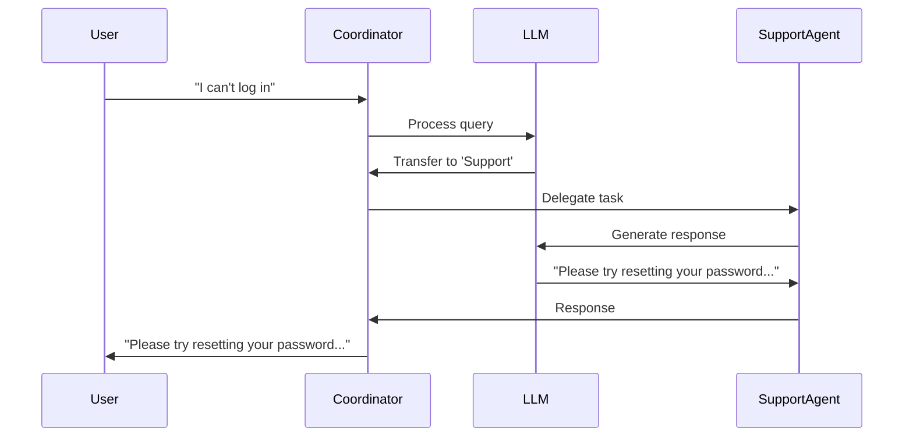

# Building Multi-Agent Systems with Google's Agent Development Kit (ADK)

The world of AI is evolving rapidly, and multi-agent systems are at the forefront of this transformation. These systems allow multiple AI agents to collaborate, delegate tasks, and solve complex problems more efficiently than single-agent setups. Google's **Agent Development Kit (ADK)** is a powerful, open-source framework that simplifies the process of building, managing, evaluating, and deploying such multi-agent systems. Optimized for Google's ecosystem but model-agnostic, ADK enables developers to create flexible and scalable AI agents using Python.

In this article, we'll explore the different types of agents you can build with ADK, the various structures for organizing multi-agent systems, and how to implement a simple multi-agent example in Python. We'll also break down the example with a sequence chart to illustrate how the agents interact. Whether you're new to agent development or looking to enhance your skills, this guide will provide you with the foundational knowledge to get started with ADK.

---

## 1. Types of ADK Agents

ADK offers several types of agents, each designed for specific purposes. These agents can be combined to create sophisticated multi-agent architectures. Below are the main types of agents in ADK, along with their corresponding Python classes.

### **LLM Agents (`LlmAgent`, aliased as `Agent`)**
- **Description**: LLM Agents are powered by Large Language Models (LLMs) and serve as the "thinking" part of your application. They can understand natural language, reason, plan, generate responses, and dynamically decide which tools to use or how to proceed. These agents are ideal for tasks that require flexibility and language comprehension.
- **Use Case**: Customer service bots, personal assistants, or any application requiring natural language interaction.

### **Workflow Agents**
Workflow Agents manage the flow of tasks in a predictable and structured manner. They include three subtypes:
- **SequentialAgent**: Executes sub-agents one after another in a fixed sequence.
- **ParallelAgent**: Runs multiple sub-agents concurrently, allowing for simultaneous task execution.
- **LoopAgent**: Repeatedly executes sub-agents until a specific condition is met.

These agents are deterministic and do not rely on LLMs for decision-making, making them perfect for orchestrating predefined processes.

### **Custom Agents (`BaseAgent`)**
- **Description**: Custom Agents provide maximum flexibility by allowing developers to define their own orchestration logic. By inheriting from `BaseAgent`, you can implement custom control flows, such as conditional execution or complex decision-making, that go beyond the standard workflow patterns.
- **Use Case**: Scenarios requiring unique or highly specific agent interactions, such as conditional routing based on runtime data.

---

## 2. Multi-Agent Structures

Multi-agent systems in ADK can be organized in various structures, each suited to different use cases. Below, we explore the most common structures and provide Mermaid diagrams to illustrate their workflows.

### **Hierarchical Coordination**
- **Description**: A central coordinator agent manages several specialized sub-agents, routing tasks to the appropriate specialist based on the input. This structure is ideal for systems where tasks need to be delegated intelligently.
- **Diagram**:
  ```mermaid
  graph TD
      Coordinator --> Sub1
      Coordinator --> Sub2
      Coordinator --> Sub3
  ```

### **Sequential Execution**
- **Description**: Agents are executed in a strict, predefined order. Each agent typically builds on the output of the previous one, making this structure suitable for linear workflows.
- **Diagram**:
  ```mermaid
  graph LR
      Agent1 --> Agent2 --> Agent3
  ```

### **Parallel Execution**
- **Description**: Multiple agents run concurrently, often to perform independent tasks simultaneously. Their results can be aggregated later if needed.
- **Diagram**:
  ```mermaid
  graph TD
      Start --> Agent1
      Start --> Agent2
      Start --> Agent3
  ```

### **Looping Execution**
- **Description**: Agents are executed repeatedly in a loop until a specific condition is satisfied. This structure is useful for iterative processes, such as refining a result over multiple steps.
- **Diagram**:
  ```mermaid
  graph TD
      Start --> Agent1
      Agent1 --> Agent2
      Agent2 --> Agent3
      Agent3 --> Condition{"Condition Met?"}
      Condition -->|No| Agent1
      Condition -->|Yes| End
  ```

These structures can be combined or extended using Custom Agents to create more complex workflows, such as conditional branching or hybrid models.

---

## 3. Simple Python Multi-Agent Example

To demonstrate how ADK enables multi-agent collaboration, let's build a simple customer service system. In this example:
- A **coordinator agent** receives user queries.
- Based on the query, it delegates the task to either a **billing agent** (for payment issues) or a **support agent** (for technical problems).
The example code repo: https://github.com/guolisen/docs_code_project/tree/main/adk_multi_agents
the jupyter notebook of https://github.com/guolisen/docs_code_project/tree/main/adk_multi_agents/multi_agent_demo.ipynb can show the example detail.

### **Python Code**
```python
from google.adk.agents import LlmAgent
from google.adk.runners import Runner
from google.adk.artifacts import InMemoryArtifactService
from google.adk.memory.in_memory_memory_service import InMemoryMemoryService
from google.adk.sessions import InMemorySessionService
from google.genai import types
import google.generativeai as genai
from google.adk.models.lite_llm import LiteLlm
import os
import logging

# Define specialized sub-agents
billing_agent = LlmAgent(
    name="Billing",
    model=LiteLlm(model="gpt-3.5-turbo-0125"),
    instruction="You handle billing and payment-related inquiries.",
    description="Handles billing inquiries."
)

support_agent = LlmAgent(
    name="Support",
    model=LiteLlm(model="gpt-3.5-turbo-0125"),
    instruction="You provide technical support and troubleshooting assistance.",
    description="Handles technical support requests."
)

# Define the coordinator agent
coordinator = LlmAgent(
    name="HelpDeskCoordinator",
    model=LiteLlm(model="gpt-3.5-turbo-0125"),
    instruction="Route user requests: Use Billing agent for payment issues, Support agent for technical problems.",
    description="Main help desk router.",
    sub_agents=[billing_agent, support_agent]
)

# For ADK compatibility, the root agent must be named `root_agent`
root_agent = coordinator

# Set up the runner
runner = Runner(
        app_name="test_agent",
        agent=root_agent,
        artifact_service=InMemoryArtifactService(),
        session_service=InMemorySessionService(),
        memory_service=InMemoryMemoryService())
```

### **Support Agent Query Example**

```python
# Test with a technical support query
support_query = "I can't access my email account, it says my password is incorrect, help to give advice"
print(f"Query: {support_query}")

# Run the query and get response and events
support_response, support_events = test_query(support_query)
print(f"Response: {support_response}")

# Extract the agent invoke path
support_path = extract_agent_path(support_events)
print(f"Agent Path: {support_path}")
```

Sample output:
```
Query: I can't access my email account, it says my password is incorrect, help to give advice
Agent Path: ['HelpDeskCoordinator', 'Support']
```

### **Billing Agent Query Example**

```python
# Test with a billing query
billing_query = "I was charged twice for my subscription last month"
print(f"Query: {billing_query}")

# Run the query and get response and events
billing_response, billing_events = test_query(billing_query)
print(f"Response: {billing_response}")

# Extract the agent invoke path
billing_path = extract_agent_path(billing_events)
print(f"Agent Path: {billing_path}")
```

Sample output:
```
Query: I was charged twice for my subscription last month
Agent Path: ['HelpDeskCoordinator', 'Billing']
```

This demonstrates how the coordinator agent intelligently routes different types of queries to the appropriate specialized agent.

---

## 4. Explanation with Sequence Chart

Let's break down how the multi-agent system processes the user query "I can't log in" using a sequence chart.

### **Sequence of Events**
1. **User sends a message** to the coordinator agent: "I can't log in."
2. **Coordinator's LLM processes the message** and determines that it is a technical support request.
3. **Coordinator delegates the task** by generating a function call to `transfer_to_agent` with `agent_name='Support'`.
4. **The framework routes execution** to the support agent.
5. **Support agent processes the query** and generates a response, such as "Please try resetting your password or check your internet connection."
6. **The response is yielded back** to the runner and sent to the user.

### **Sequence Diagram**


This sequence demonstrates how ADK's hierarchical coordination enables intelligent task delegation, allowing specialized agents to handle specific types of queries efficiently.

---

## Conclusion

Google's Agent Development Kit (ADK) is a game-changer for developers looking to build scalable, multi-agent AI systems. With its support for LLM-powered agents, structured workflow agents, and custom orchestration logic, ADK provides the flexibility needed to tackle a wide range of applications—from customer service bots to complex data pipelines. By understanding the different agent types and multi-agent structures, you can design systems that are both powerful and easy to manage.

The example provided illustrates just one of many possibilities. As you explore ADK further, you'll discover even more ways to combine agents, tools, and workflows to solve real-world problems. So, dive into the [ADK documentation](https://google.github.io/adk-docs/) and start building your own multi-agent applications today!

---

**Sources**  
This article is based on information from the official ADK documentation and related resources. For more details, refer to the [ADK Multi-Agent Systems page](https://google.github.io/adk-docs/agents/multi-agents/).

---

### Notes on Mermaid Diagrams
- **Rendering**: The Mermaid code blocks can be rendered into diagrams using tools like the Mermaid Live Editor or the Mermaid CLI.
- **Platform Compatibility**: If publishing on platforms that do not support Mermaid directly (e.g., Medium), you can generate images from the Mermaid code and embed them in the article.
