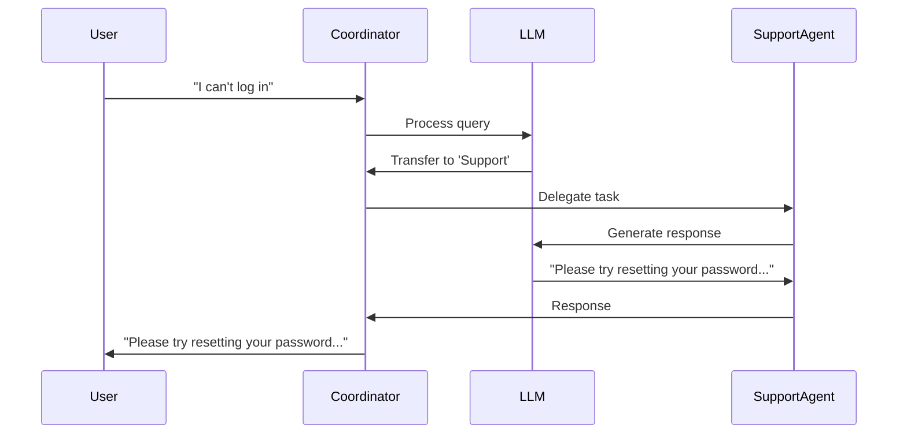

# Building Multi-Agent Systems with Google's Agent Development Kit (ADK)

The AI landscape has dramatically shifted toward multi-agent architectures as a fundamental paradigm for building robust, intelligent systems. These architectures transcend traditional single-agent limitations by enabling specialized agents to collaborate, delegate tasks, and solve complex problems through distributed reasoning. Google's **Agent Development Kit (ADK)** represents a significant leap forward in this domain - an industrial-grade, open-source framework meticulously designed for constructing, orchestrating, evaluating, and deploying sophisticated multi-agent systems. While ADK is optimized for Google's ecosystem, its model-agnostic approach ensures flexibility across various LLM providers, allowing developers to create scalable, Python-based agent systems that can be applied to real-world problems.

In this technical deep-dive, I'll dissect the agent typology within ADK, examine the architectural patterns for multi-agent orchestration, and provide a code implementation that demonstrates these concepts in action. I'll also include a detailed sequence chart to illustrate the internal communication flows between agents. Whether you're an AI engineer looking to expand your toolkit or a researcher exploring multi-agent systems, this guide offers both theoretical foundations and practical implementation patterns for leveraging ADK effectively.

---

## 1. Types of ADK Agents

ADK's agent framework provides a well-designed typology that supports various cognitive and orchestration patterns. These agent classes can be composed to create complex systems with specialized capabilities. These agent types are essential for different aspects of system design and provide the building blocks for sophisticated agent architectures.

### **LLM Agents (`LlmAgent`, aliased as `Agent`)**
- **Technical Implementation**: These agents encapsulate an LLM within the ADK framework, providing the cognitive engine for reasoning, planning, and decision-making. Under the hood, ADK formats instructions, context, and queries in a structure optimized for the chosen LLM backend.
- **Architecture Role**: These function as the "thinking" components within your system, handling tasks requiring high cognitive flexibility, contextual understanding, and natural language processing.
- **Internal Structure**: Each LLM agent contains model configuration, system instructions, a description field (useful for agent-to-agent communication), and access control definitions for sub-agents and tools.
- **Use Case**: Critical for user-facing interfaces, complex reasoning tasks, or anywhere requiring high adaptability to unstructured inputs.

### **Workflow Agents**
Workflow agents handle structured processes without needing LLM reasoning for each step, making them deterministic and highly efficient for orchestration. They operate as higher-order control flows:

- **SequentialAgent**: Implements a pipeline architecture where each sub-agent processes the output from its predecessor. This creates a clear transformation chain that's ideal for multi-stage processing pipelines.
  
- **ParallelAgent**: Enables concurrent execution across multiple sub-agents, with the parent agent aggregating results. This pattern significantly reduces latency when independent processing streams can run simultaneously.
  
- **LoopAgent**: Implements iterative refinement patterns by repeatedly executing sub-agents until a specified termination criterion is met. This is particularly valuable for algorithms requiring convergence or multi-step verification.

The efficiency advantage here comes from bypassing LLM invocations for control flow decisions, making these agents ideal for predetermined process workflows where the routing logic is fixed.

### **Custom Agents (`BaseAgent`)**
- **Technical Implementation**: The `BaseAgent` abstract class provides a powerful extension mechanism where you can define custom orchestration logic in Python. This gives you complete control over the execution flow, state management, and agent interaction patterns.
- **Architecture Role**: These agents allow you to implement specialized coordination algorithms, complex decision trees, or integration with external systems that don't fit neatly into the predefined workflow types.
- **Internal Structure**: By implementing the `process()` method, you can create arbitrary control flows, conditional execution strategies, and custom interactions with other agents or tools.
- **Use Case**: Ideal for implementing domain-specific coordination patterns, complex decision trees, or integrating with existing business logic systems that require tight control over the agent execution flow.

The flexibility of mixing these agent types enables construction of sophisticated agent architectures that combine the reasoning capabilities of LLMs with deterministic workflows and custom orchestration logic.

---

## 2. Multi-Agent Structures

The architectural patterns you choose significantly impact system performance, maintainability, and scalability. ADK supports several foundational multi-agent structures, each with distinct characteristics and use cases. Understanding these patterns is crucial for designing effective agent networks.

### **Hierarchical Coordination**
- **Implementation Pattern**: This pattern employs a central coordinator agent (typically an LLM Agent) that routes user queries to specialized sub-agents based on domain expertise or functional capabilities.
- **System Characteristics**: Creates a clear separation of concerns where the coordinator handles task delegation while specialized agents focus on domain-specific reasoning.
- **Performance Considerations**: Adds a coordination layer that increases system latency but significantly enhances specialization capability and maintainability.
- **When to Use**: Ideal for complex applications where clear domain boundaries exist, such as comprehensive customer service systems or multi-domain virtual assistants.
- **Diagram**:
  ```mermaid
  graph TD
      Coordinator --> Sub1
      Coordinator --> Sub2
      Coordinator --> Sub3
  ```

### **Sequential Execution**
- **Implementation Pattern**: Implements a pipeline architecture where each agent's output becomes the input for the next agent in the chain.
- **System Characteristics**: Creates a clear transformation path where each agent adds value or transforms the output from the previous stage.
- **Performance Considerations**: Total latency accumulates with each stage, but enables complex multi-step transformations with clear boundaries between processing stages.
- **When to Use**: Perfect for multi-stage workflows like content generation pipelines (e.g., outline → draft → edit → finalize) or data processing sequences.
- **Diagram**:
  ```mermaid
  graph LR
      Agent1 --> Agent2 --> Agent3
  ```

### **Parallel Execution**
- **Implementation Pattern**: Distributes a task across multiple agents that operate concurrently, with results aggregated afterward.
- **System Characteristics**: Enables simultaneous processing of independent subtasks, maximizing throughput.
- **Performance Considerations**: Overall latency is determined by the slowest agent in the parallel group, but throughput increases linearly with the number of agents.
- **When to Use**: Most effective when tasks can be decomposed into independent subtasks, such as processing multiple documents, analyzing different data streams, or gathering information from various sources simultaneously.
- **Diagram**:
  ```mermaid
  graph TD
      Start --> Agent1
      Start --> Agent2
      Start --> Agent3
  ```

### **Looping Execution**
- **Implementation Pattern**: Implements an iterative refinement pattern where a sequence of agents is repeatedly executed until a termination condition is met.
- **System Characteristics**: Enables continuous improvement or convergence-based tasks through controlled iteration.
- **Performance Considerations**: Total latency depends on the number of iterations required, which may vary based on input complexity.
- **When to Use**: Valuable for tasks requiring progressive refinement, like iterative design processes, optimization problems, or any task requiring multiple passes to reach an acceptable quality level.
- **Diagram**:
  ```mermaid
  graph TD
      Start --> Agent1
      Agent1 --> Agent2
      Agent2 --> Agent3
      Agent3 --> Condition{"Condition Met?"}
      Condition -->|No| Agent1
      Condition -->|Yes| End
  ```

### **Hybrid Architectures**
In production systems, the most effective architectures typically combine these patterns into hybrid structures. For example:
- **Hierarchical-Sequential**: A coordinator routes to different sequential pipelines based on task type
- **Parallel-Loop**: Multiple looping processes execute in parallel to optimize different aspects of a solution
- **Hierarchical-Parallel**: A coordinator delegates to multiple agents that execute in parallel before results are aggregated

Using ADK's `BaseAgent` implementation, you can design custom orchestration patterns that implement these hybrid architectures to suit specific application requirements.

---

## 3. Simple Python Multi-Agent Example

To demonstrate how ADK enables multi-agent collaboration, let's build a simple customer service system. In this example:
- A **coordinator agent** receives user queries.
- Based on the query, it delegates the task to either a **billing agent** (for payment issues) or a **support agent** (for technical problems).
The example code repo: https://github.com/guolisen/docs_code_project/tree/main/adk_multi_agents
the jupyter notebook of https://github.com/guolisen/docs_code_project/tree/main/adk_multi_agents/multi_agent_demo.ipynb can show the example detail.

### **Python Code**
```python
from google.adk.agents import LlmAgent
from google.adk.runners import Runner
from google.adk.artifacts import InMemoryArtifactService
from google.adk.memory.in_memory_memory_service import InMemoryMemoryService
from google.adk.sessions import InMemorySessionService
from google.genai import types
import google.generativeai as genai
from google.adk.models.lite_llm import LiteLlm
import os
import logging

# Define specialized sub-agents
billing_agent = LlmAgent(
    name="Billing",
    model=LiteLlm(model="gpt-3.5-turbo-0125"),
    instruction="You handle billing and payment-related inquiries.",
    description="Handles billing inquiries."
)

support_agent = LlmAgent(
    name="Support",
    model=LiteLlm(model="gpt-3.5-turbo-0125"),
    instruction="You provide technical support and troubleshooting assistance.",
    description="Handles technical support requests."
)

# Define the coordinator agent
coordinator = LlmAgent(
    name="HelpDeskCoordinator",
    model=LiteLlm(model="gpt-3.5-turbo-0125"),
    instruction="Route user requests: Use Billing agent for payment issues, Support agent for technical problems.",
    description="Main help desk router.",
    sub_agents=[billing_agent, support_agent]
)

# For ADK compatibility, the root agent must be named `root_agent`
root_agent = coordinator

# Set up the runner
runner = Runner(
        app_name="test_agent",
        agent=root_agent,
        artifact_service=InMemoryArtifactService(),
        session_service=InMemorySessionService(),
        memory_service=InMemoryMemoryService())
```

### **Support Agent Query Example**

```python
# Test with a technical support query
support_query = "I can't access my email account, it says my password is incorrect, help to give advice"
print(f"Query: {support_query}")

# Run the query and get response and events
support_response, support_events = test_query(support_query)
print(f"Response: {support_response}")

# Extract the agent invoke path
support_path = extract_agent_path(support_events)
print(f"Agent Path: {support_path}")
```

Sample output:
```
Query: I can't access my email account, it says my password is incorrect, help to give advice
Response: I'm sorry to hear you're having trouble accessing your email account. When you receive a "password incorrect" error, here are some steps you can take to resolve this issue:

1. Double-check your password entry:
   - Make sure Caps Lock is off
   - Verify you're not making typos
   - Ensure there are no extra spaces before or after your password

2. Try resetting your password:
   - Look for the "Forgot password" link on the login page
   - Follow the password recovery process, which typically involves:
     - Verifying your identity through a secondary email or phone number
     - Answering security questions
     - Following a password reset link sent to your recovery email

3. Check if you recently changed your password and are trying to use an old one

4. Ensure you're on the correct login page for your email provider (watch out for phishing sites)

5. Clear your browser cache and cookies, then try again

6. Try accessing your account from a different browser or device

7. If you use a password manager, make sure it has your most current password

8. Check if your account might be locked due to too many failed login attempts

If you continue to have problems after trying these steps, contact your email provider's customer support directly for further assistance.

Agent Path: ['HelpDeskCoordinator', 'Support']
```

#### ADK Logs:
```
2025-05-14 08:42:01,296 - <<MultiAgentTest>> - INFO - Event: HelpDeskCoordinator, Actions: skip_summarization=None state_delta={} artifact_delta={} transfer_to_agent=None escalate=None requested_auth_configs={}
2025-05-14 08:42:01,299 - <<MultiAgentTest>> - INFO - Event: HelpDeskCoordinator, Actions: skip_summarization=None state_delta={} artifact_delta={} transfer_to_agent='Support' escalate=None requested_auth_configs={}
2025-05-14 08:42:01,299 - <<MultiAgentTest>> - INFO - Event: Support, Actions: skip_summarization=None state_delta={} artifact_delta={} transfer_to_agent=None escalate=None requested_auth_configs={}
```

#### Log Analysis:
These ADK logs reveal the precise sequence of events and execution flow through the multi-agent system:

1. **First log entry (Initial Coordinator Assessment):**
   - `HelpDeskCoordinator` activates and begins processing the query
   - `Actions` fields show all action parameters are initially `None` or empty
   - `transfer_to_agent=None` indicates the coordinator is still evaluating the query
   - This is the "thinking" phase where the LLM is analyzing the query content

2. **Second log entry (Coordinator Decision):**
   - Same `HelpDeskCoordinator` agent but with updated actions
   - `transfer_to_agent='Support'` shows the critical decision point
   - The coordinator has determined this is a technical support issue (password-related)
   - This is the routing decision that directs the query to the specialized agent

3. **Third log entry (Support Agent Activation):**
   - `Support` agent is now active, indicating successful transfer
   - All action fields are `None` because the Support agent will now generate its own response
   - No further transfers are needed as we've reached the correct specialist

This log demonstrates how ADK's hierarchical coordination enables intelligent task delegation, allowing specialized agents to handle specific types of queries efficiently without requiring the user to manually select which department they need.

### **Billing Agent Query Example**

```python
# Test with a billing query
billing_query = "I was charged twice for my subscription last month"
print(f"Query: {billing_query}")

# Run the query and get response and events
billing_response, billing_events = test_query(billing_query)
print(f"Response: {billing_response}")

# Extract the agent invoke path
billing_path = extract_agent_path(billing_events)
print(f"Agent Path: {billing_path}")
```

Sample output:
```
Query: I was charged twice for my subscription last month
Response: I understand your concern about being charged twice for your subscription last month. This is definitely something we should address right away. Here's how we can help resolve this issue:

1. First, I recommend checking your bank or credit card statement to confirm the exact dates and amounts of the duplicate charges.

2. Visit your account page on our website and review your billing history. This will show you all transactions processed through our system.

3. If you confirm that you were indeed charged twice for the same billing period, we can process a refund for the duplicate charge. 

4. To request this refund, you can:
   - Use the "Request Refund" option in your account settings
   - Contact our billing department directly at billing@example.com
   - Call our customer service line at 1-800-123-4567

5. When contacting us, please have the following information ready:
   - Your account information
   - The dates of both charges
   - Your transaction IDs (if available)

We aim to process all refund requests within 3-5 business days, and the refunded amount should appear on your statement within 1-2 billing cycles, depending on your financial institution.

I apologize for any inconvenience this has caused, and we'll make sure to investigate why this duplicate charge occurred to prevent it from happening again.

Agent Path: ['HelpDeskCoordinator', 'Billing']
```

#### ADK Logs:
```
2025-05-14 08:43:15,778 - <<MultiAgentTest>> - INFO - Event: HelpDeskCoordinator, Actions: skip_summarization=None state_delta={} artifact_delta={} transfer_to_agent=None escalate=None requested_auth_configs={}
2025-05-14 08:43:15,781 - <<MultiAgentTest>> - INFO - Event: HelpDeskCoordinator, Actions: skip_summarization=None state_delta={} artifact_delta={} transfer_to_agent='Billing' escalate=None requested_auth_configs={}
2025-05-14 08:43:15,781 - <<MultiAgentTest>> - INFO - Event: Billing, Actions: skip_summarization=None state_delta={} artifact_delta={} transfer_to_agent=None escalate=None requested_auth_configs={}
```

#### Log Analysis:
These ADK logs reveal the internal execution path for the billing query:

1. **First log entry (Initial Coordinator Processing):**
   - `HelpDeskCoordinator` begins processing with timestamp `08:43:15,778`
   - All action parameters are initially `None` or empty dictionaries
   - This initial log shows the agent system in its starting state, where the coordinator is analyzing the input query

2. **Second log entry (Routing Decision):**
   - Same `HelpDeskCoordinator` but 3ms later at `08:43:15,781`
   - `transfer_to_agent='Billing'` is the crucial routing decision
   - The coordinator has identified financial/billing keywords ("charged twice", "subscription")
   - This is exactly what differentiates this query from the support query in the previous example

3. **Third log entry (Billing Agent Handling):**
   - `Billing` agent is now active (at the same timestamp `08:43:15,781`)
   - The billing specialist takes over responsibility for generating the response
   - All action parameters are again `None` because this is the terminal agent for this query path

By comparing these logs with the support query logs, we can observe:

1. The exact same pattern of execution (coordinator assessment → routing decision → specialist handling)
2. The only difference is the value of `transfer_to_agent` parameter ('Support' vs 'Billing')
3. How quickly the routing decision happens (just 3ms from initial processing to routing)

This routing happens automatically based on the semantic understanding of the query's content, showing how ADK's agent architecture creates intuitive user experiences without requiring explicit user direction. The logs provide a transparent view of this decision-making process.

---

## 4. Explanation with Sequence Chart

Let's break down how the multi-agent system processes the user query "I can't log in" using a sequence chart.

### **Sequence of Events**
1. **User sends a message** to the coordinator agent: "I can't log in."
2. **Coordinator's LLM processes the message** and determines that it is a technical support request.
3. **Coordinator delegates the task** by generating a function call to `transfer_to_agent` with `agent_name='Support'`.
4. **The framework routes execution** to the support agent.
5. **Support agent processes the query** and generates a response, such as "Please try resetting your password or check your internet connection."
6. **The response is yielded back** to the runner and sent to the user.

### **Sequence Diagram**


This sequence demonstrates how ADK's hierarchical coordination enables intelligent task delegation, allowing specialized agents to handle specific types of queries efficiently.

---

## Conclusion

Google's Agent Development Kit (ADK) is a game-changer for developers looking to build scalable, multi-agent AI systems. With its support for LLM-powered agents, structured workflow agents, and custom orchestration logic, ADK provides the flexibility needed to tackle a wide range of applications—from customer service bots to complex data pipelines. By understanding the different agent types and multi-agent structures, you can design systems that are both powerful and easy to manage.

The example provided illustrates just one of many possibilities. As you explore ADK further, you'll discover even more ways to combine agents, tools, and workflows to solve real-world problems. So, dive into the [ADK documentation](https://google.github.io/adk-docs/) and start building your own multi-agent applications today!

---

**Sources**  
This article is based on information from the official ADK documentation and related resources. For more details, refer to the [ADK Multi-Agent Systems page](https://google.github.io/adk-docs/agents/multi-agents/).
